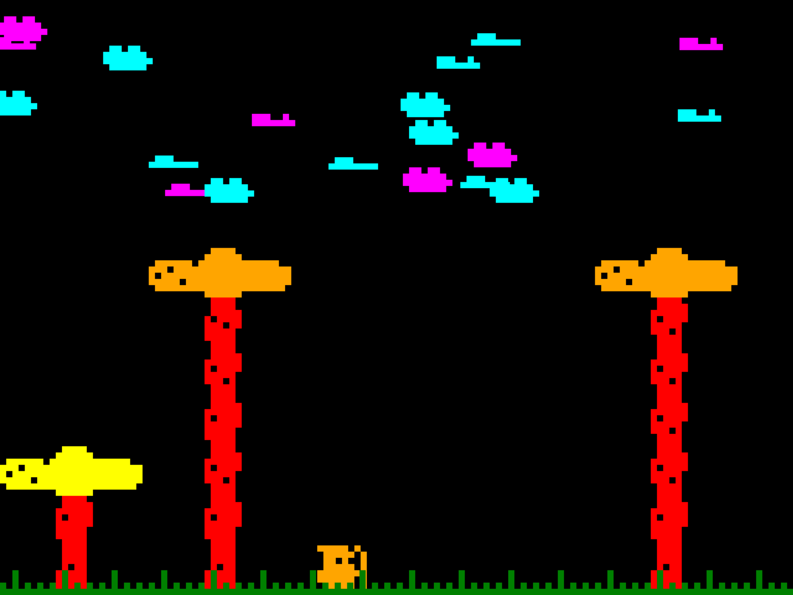

# Nariz



Nariz is a minimal JavaScript game framework for browser games (little demos for now), focusing on simplicity, modularity, and pixel-perfect rendering. It provides a basic entity-component system, sprite handling, event management, and a virtual viewport for retro-style games.


> **Note:** This project was created as a fun exercise to explore how common game development challenges can be addressed using a modular, component-based approach. It is not intended to be a serious or production-ready framework, but rather a learning tool for experimenting with game architecture, modularity, and retro rendering techniques.

---

## Features

- **Entity System**: Define and manage game objects with properties, animation, and behaviors.
- **Sprite Rendering**: 8x8 pixel sprites, composable into larger entities.
- **Virtual Viewport**: Pixel-perfect scaling, aspect ratio management, and virtual coordinates.
- **Event System**: Map keyboard and DOM events to game actions.
- **Game Loop**: Modular, with per-module and per-entity update hooks.
- **Modular Design**: Extendable via modules for sprites, entities, events, viewport, and game logic.

---

## Getting Started

### 1. Clone or Download

Copy the repository or the [`index.html`](index.html ) file to your project.

### 2. Open [`index.html`](index.html )

All framework code is self-contained in the HTML file. Open it in your browser to see the demo.

---

## Usage

### Defining Entities

Entities are defined in the `entities` array:

```js
entities: [
  {
    id: 'hero',
    name: 'Hero',
    animationSpeed: 0.2,
    speedX: 1.4,
    hp: 10,
    spriteGroup: 'archer',
    color: 'orange',
    x: '50%',
    y: '100%-height',
  },
  // ... more entities
]
```

- **spriteGroup**: Name of the sprite group (see Sprites).
- **x, y**: Position (supports expressions like `'50%'`, `'100%-height'`).
- **color**: Fill color.
- **count**: Number of instances.
- **Custom properties**: Add any property you need.

### Defining Sprites

Sprites are 8x8 bitmaps, defined as hex strings:

```js
spriteGroups: {
  'archer': {
    idle: ['FA7D697DFFFD7D46', '02F97D697FFDFD46']
  },
  // ...
}
```

- Each string is a row-major 8x8 bitmap (16 hex digits).
- Multiple frames for animation.

### Handling Events

Define actions and map them to keys or DOM events:

```js
NARIZ.EVENT.define('left', [{ event: 'key', code: 'ArrowLeft' }]);
NARIZ.EVENT.define('resize', [{ event: 'resize' }]);
```

Handle actions in the `_ON` object of a module:

```js
_ON: {
  left() {
    NARIZ.ENTITIES.moveEntityLeft('hero');
  }
}
```

### Game Loop and Modules

Each module can define:

- `_INIT()`: Called on startup.
- `_READY()`: Called after all modules are initialized.
- `_PROCESS(currentTime, deltaInSeconds)`: Called every frame.
- `_ON`: Event handlers.

---

## Customization

- **Add new modules**: Use `NARIZ._registerModule('name', { ... })`.
- **Add new entities or sprites**: Edit the `entities` or `spriteGroups` arrays.
- **Change viewport size**: Edit `NARIZ.VIEWPORT._SETUP(width, height, cellSize, metersPerCell)` in the `game` module.

---

## Example: Adding a New Entity

```js
{
  id: 'enemy',
  spriteGroup: 'swordman',
  color: 'red',
  x: '80%',
  y: '100%-height',
  speedX: 1.0,
  count: 3
}
```

---

## Development

- All code is in [`index.html`](index.html ).
- No build step required.
- Edit and reload in your browser.

---

## Sprite Creation

You can create 8x8 sprites for your game using the [UDG Sprite Editor](https://www.sebastian.it/udg). Design your sprite, export the hex string, and use it in your `spriteGroups` definitions.

---

## License

MIT License. See [`LICENSE`](LICENSE ) for details.

---

## Credits

Created by n0-se (that's me). Inspired by [Godot Engine](https://godotengine.org/), retro games, 8-bit Computers and 8-bit Consoles.  
Hex Sprites based on work from [Orix](www.oryxdesignlab.com) (first seen on [TIGSource](https://forums.tigsource.com/index.php?topic=8970.0)).

---

## Contributing

Pull requests and issues are welcome!
